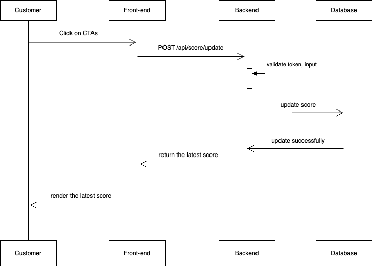

# **Scoreboard API Module - Specification**

## **Overview**

This module provides an API service for updating and retrieving a scoreboard. It ensures real-time updates and prevents unauthorized score modifications.

## **Features**

1. **Retrieve Top Scores**: API endpoint to fetch the top 10 user scores.
2. **Update Score**: API endpoint to increase a user's score upon completing an action.
3. **Real-time Updates**: WebSocket or polling mechanism to provide live scoreboard updates.
4. **Security Measures**: Implement authentication and anti-cheat mechanisms.

---

## **API Endpoints**

### **1. Retrieve Top 10 Scores**

- **Endpoint**: `GET /api/scoreboard`
- **Description**: Returns the top 10 users based on scores.
- **Response**:

  ```json
  {
    "scores": [
      {"user": "Alice", "score": 1500},
      {"user": "Bob", "score": 1400}
    ]
  }
  ```

- **Security**:
  - Public access.
  - Apply rate limiting to prevent abuse.
  - Implement caching to reduce database load.

---

### **2. Update User Score**

- **Endpoint**: `POST /api/score/update`
- **Request Body**:

  ```json
  {
    "userId": "12345",
    "scoreIncrement": 10
  }
  ```

- **Response**:

  ```json
  {
    "message": "Score updated successfully",
    "newScore": 1510
  }
  ```

- **Security**:
  - Requires authentication (e.g., JWT, OAuth).
  - Only authorized actions trigger this endpoint.
  - Apply rate limiting to prevent abuse.
  - Validate the request body to prevent negative score increments.

---

## **Flow Diagram**

A flow diagram would illustrate:

1. User performs an action.
2. Action triggers an API call to update the score.
3. The backend validates the request.
4. The score is updated in the database.
5. The frontend receives a real-time update.



---

## **Technologies**

- **Frontend**: ReactJS or NextJS
- **Backend**: NestJS (Node.js) and Restful API
- **Database**: PostgreSQL / MySQL / MongoDB (depends on the business) / Redis (for caching)
- **Authentication**: JWT / OAuth
- **Real-time updates**: WebSockets (Socket.IO)
- **Rate Limiting**: Express Rate Limit
- **Documentation**: Swagger - OpenAPI
